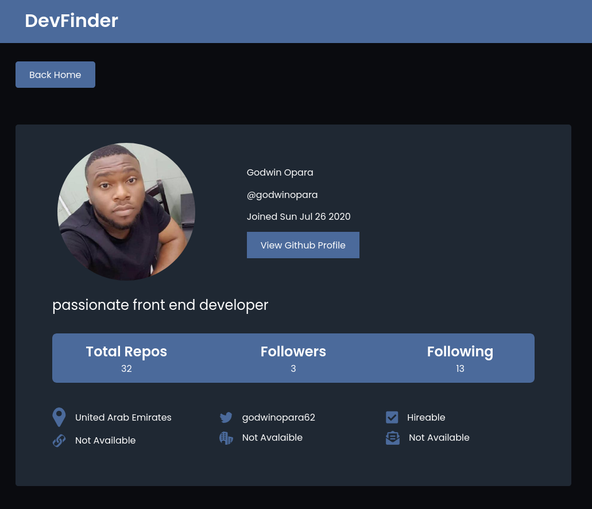

# Dev Finder

## Table of contents

- [Overview](#overview)
  - [The challenge](#the-challenge)
  - [Screenshot](#screenshot)
  - [Links](#links)
- [My process](#my-process)

  - [Built with](#built-with)
  - [What I learned](#what-i-learned)

- [Author](#author)

## Overview

### The challenge

Users should be able to:

- View the optimal layout for each page depending on their device's screen size
- Search for github repos and view the details like email, website, company name
- vist the user website and also view the repos on github.com

### Screenshot

### Links

- Live Site URL: [Demo](https://findgithubdev.netlify.app/)

## My process

### Built with

- Semantic HTML5 markup
- Flexbox
- CSS Grid
- Mobile-first workflow
- [React](https://reactjs.org/) - JS library
- [React Router](https://react-router.com)
- [Axios](https://axios-http.com/) - For Making Request
- [Sass](https://sass-lang.com/) - For styles

### What I learned

Learnt how to use the React context along side the React useReducer hooks for for a flux like pattern

To see how you can add code snippets, see below:

## Author

- Website - [godwinopara](https://www.your-site.com)
- Twitter - [@godwinopara12](https://www.twitter.com/godwinopara12)
